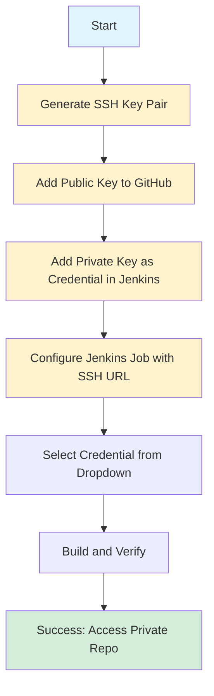
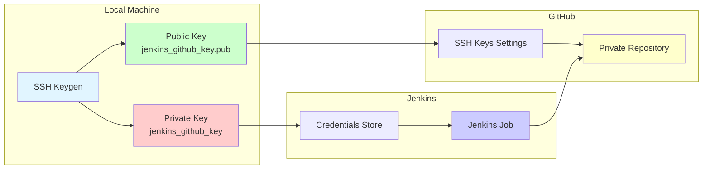
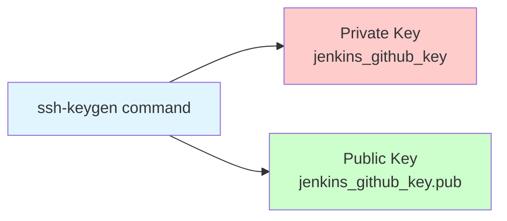
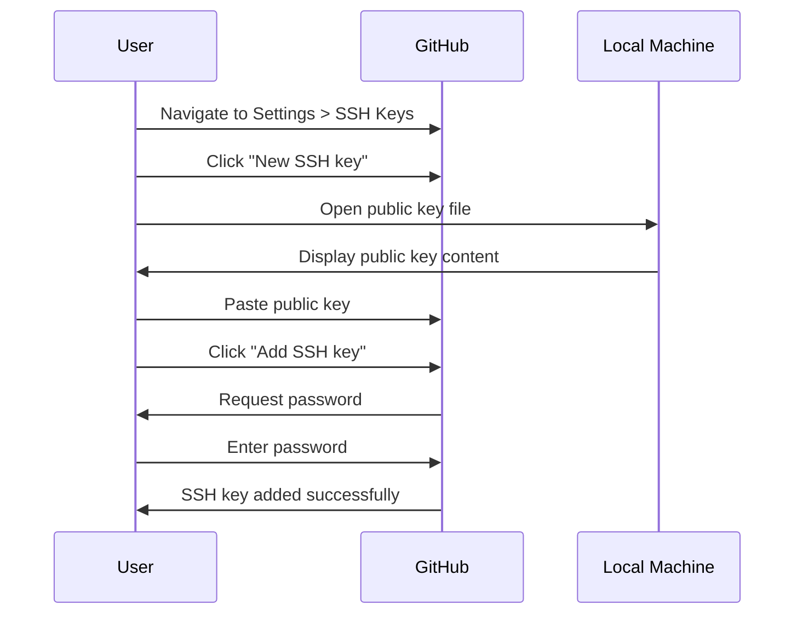
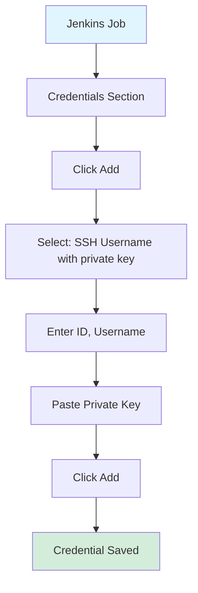
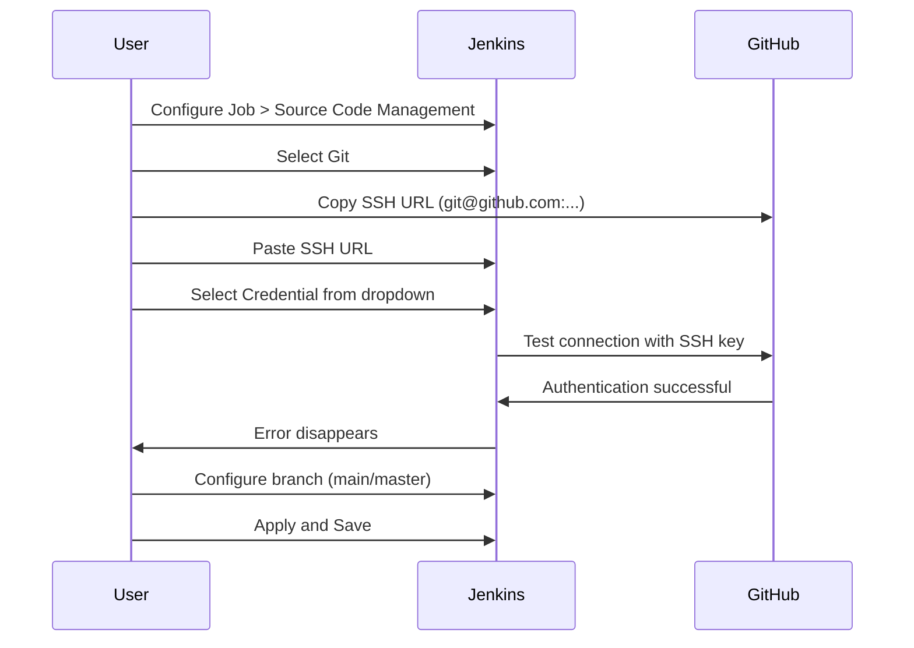
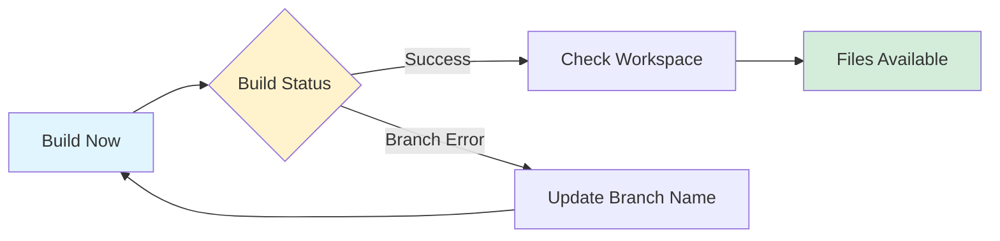
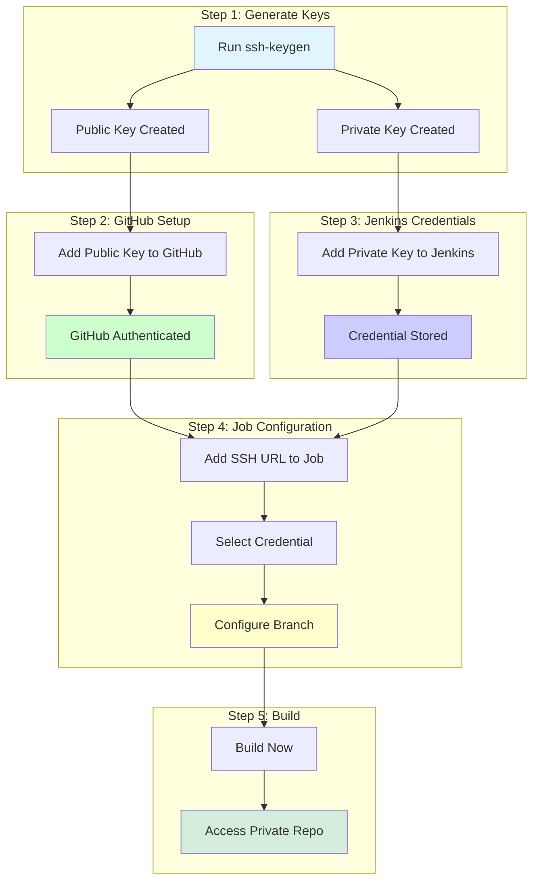
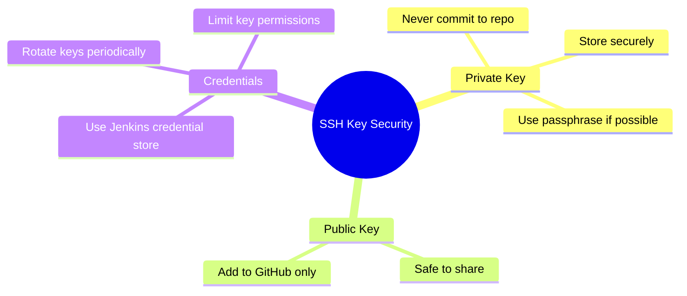

# GitHub Private Repository Access with SSH Key in Jenkins

This guide explains how to access a private GitHub repository using SSH keys in Jenkins.

## Overview

This tutorial walks you through the complete process of setting up SSH key authentication to access private GitHub repositories from Jenkins.



## Architecture Diagram



## Prerequisites

- GitHub account with a private repository
- Jenkins instance installed and running
- Command line access to your local machine (Windows, Linux, or macOS)

## Platform-Specific Notes

| Platform | SSH Key Location | Terminal | Text Editor Options |
|----------|-----------------|----------|---------------------|
| **Windows** | `C:\Users\Username\.ssh\` | Command Prompt, PowerShell | Notepad++, Notepad |
| **Linux** | `~/.ssh/` or `/home/username/.ssh/` | Terminal (bash, zsh, etc.) | nano, vim, gedit, cat |
| **macOS** | `~/.ssh/` | Terminal (bash, zsh) | nano, vim, TextEdit, cat |

> **Note**: All platforms use the same `ssh-keygen` command. The process is identical across platforms, only the file paths and editor preferences differ.

## Step 1: Generate SSH Key Pair

On your local system, SSH keys are stored in your user's `.ssh` folder:
- **Windows**: `C:\Users\YourUsername\.ssh\`
- **Linux/macOS**: `~/.ssh/` or `/home/username/.ssh/`


### Windows
1. Open **Command Prompt** or **PowerShell**
2. Navigate to your user directory (optional, keys will be created in `.ssh` folder automatically)
3. Run the following command:

```bash
ssh-keygen
```

### Linux/macOS
1. Open **Terminal**
2. The `.ssh` folder will be created automatically in your home directory
3. Run the following command:

```bash
ssh-keygen
```

### For Both Platforms
3. When prompted, provide a filename for your key (e.g., `jenkins_github_key`)
4. Press Enter to skip the passphrase (or set one if preferred)

This will create two files in your `.ssh` folder:
- **Private key**: `jenkins_github_key` (keep this secure)
- **Public key**: `jenkins_github_key.pub` (this will be added to GitHub)

> **Note**: On Linux/macOS, you can also use `cat ~/.ssh/jenkins_github_key.pub` to display the public key directly in the terminal.



## Step 2: Add Public Key to GitHub


1. Log in to your GitHub account
2. Go to **Settings** → **SSH and GPG keys**
3. Click on **New SSH key**


4. Give your key a title (e.g., "Jenkins Access Key")
5. Open your public key file (`jenkins_github_key.pub`) in a text editor:
   - **Windows**: Notepad++, Notepad, or any text editor
   - **Linux**: `nano ~/.ssh/jenkins_github_key.pub`, `vim ~/.ssh/jenkins_github_key.pub`, or `gedit ~/.ssh/jenkins_github_key.pub`
   - **macOS**: `nano ~/.ssh/jenkins_github_key.pub`, `vim ~/.ssh/jenkins_github_key.pub`, or TextEdit
   - **Alternative (Linux/macOS)**: Use `cat ~/.ssh/jenkins_github_key.pub` to display and copy directly from terminal
6. Copy the entire content of the public key
7. Paste it into the "Key" section on GitHub
8. Click **Add SSH key**
9. Enter your GitHub password when prompted

Your SSH key has been successfully added to your GitHub account.



## Step 3: Add Credential in Jenkins


1. In your Jenkins job, go to the **Credentials** section
2. Click **Add**
3. From the dropdown, select **SSH Username with private key**


4. Fill in the following:
   - **ID**: Give it a unique identifier (e.g., `github-ssh-key`)
   - **Username**: Your GitHub username
   - **Private Key**: Select the radio button for "Enter directly"
5. Open your private key file (`jenkins_github_key`) in a text editor:
   - **Windows**: Notepad++, Notepad, or any text editor
   - **Linux**: `nano ~/.ssh/jenkins_github_key`, `vim ~/.ssh/jenkins_github_key`, or `gedit ~/.ssh/jenkins_github_key`
   - **macOS**: `nano ~/.ssh/jenkins_github_key`, `vim ~/.ssh/jenkins_github_key`, or TextEdit
   - **Alternative (Linux/macOS)**: Use `cat ~/.ssh/jenkins_github_key` to display and copy directly from terminal
6. Copy the entire content of the private key (including `-----BEGIN` and `-----END` lines)
7. Paste it into the "Private Key" field in Jenkins
8. Click **Add**

Your credential has been successfully added to Jenkins.



## Step 4: Configure Jenkins Job with SSH URL


1. In your Jenkins job configuration, go to the **Source Code Management** section
2. Select **Git**
3. For the **Repository URL**, use the SSH URL (not the HTTPS URL):


   - On your GitHub repository page, click **Code** → **SSH**
   - Copy the SSH URL (format: `git@github.com:username/repository.git`)
4. Paste the SSH URL into the **Repository URL** field
5. From the **Credentials** dropdown, select the credential you created in Step 3
6. Click outside the field to verify - the authentication error should disappear
7. Configure the branch name (e.g., `main` or `master` depending on your repository)
8. Click **Apply** and **Save**



## Step 5: Build and Verify

1. Click **Build Now** in your Jenkins job


2. If you encounter branch-related errors, go back to **Configure** and ensure the branch name matches your repository's default branch (usually `main` instead of `master`)
3. Once the build succeeds, you can verify by checking the **Workspace** - all files from your GitHub repository should be available




## Troubleshooting

### Authentication Error
- Ensure the public key is correctly added to your GitHub account
- Verify the private key content is complete (including BEGIN/END markers)
- Check that the correct credential is selected in the Jenkins job

### Branch Not Found
- Verify your repository's default branch name (`main` vs `master`)
- Update the branch name in Jenkins job configuration accordingly

### Permission Denied
- **Linux/macOS**: Ensure the SSH key has correct permissions:
  ```bash
  chmod 600 ~/.ssh/jenkins_github_key
  chmod 644 ~/.ssh/jenkins_github_key.pub
  ```
- Verify the GitHub username matches the one used in Jenkins credentials
- On Windows, permission issues are less common, but ensure the key file is readable

## Complete Workflow Diagram



## Summary

By following these steps, you can:
- Generate SSH key pairs for secure authentication
- Add public keys to GitHub for repository access
- Configure Jenkins to use private SSH keys for authentication
- Access private GitHub repositories in Jenkins jobs

This setup provides a secure way to integrate your private GitHub repositories with Jenkins using SSH key authentication.

## Security Best Practices



- **Never commit private keys** to version control
- **Use strong passphrases** for production environments
- **Rotate SSH keys** periodically
- **Limit key permissions** in GitHub (if using deploy keys, limit to specific repositories)
- **Use Jenkins credential store** instead of hardcoding keys

